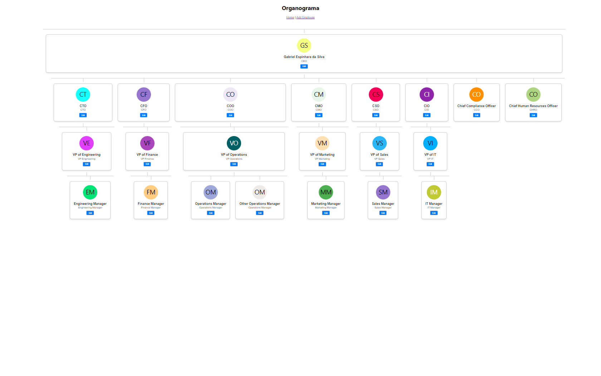

# Organograma de Empresa

Este projeto é uma aplicação web para gerenciar o organograma de uma empresa. Ele permite adicionar, editar e visualizar a estrutura hierárquica dos funcionários.


## Tecnologias Utilizadas

- **Frontend**: React.js
- **Backend**: Node.js com Express
- **Banco de Dados**: MySQL
- **ORM**: Knex.js

## Pré-requisitos

- Node.js instalado
- MySQL instalado

## Configuração do Projeto

### Backend

1. Clone o repositório:
   ```bash
   git clone https://github.com/espinhara/organograma.git
   cd organograma
   ```

2. Instale as dependências:
   ```bash
   npm install
   ```

3. Configure o banco de dados MySQL:
   - Crie um banco de dados no MySQL.
   - Renomeie o arquivo `.env.example` para `.env` e configure as variáveis de ambiente:
     ```
     DB_HOST=localhost
     DB_USER=espinhara
     DB_PASSWORD=sua-senha
     DB_NAME=nome-do-banco
     ```

4. Configure o Knex e migre as tabelas:
   ```bash
   npx knex migrate:latest
   ```

5. Inicie o servidor:
   ```bash
   npx nodemon src/index.js
   ```

### Frontend

1. Navegue até o diretório do frontend:
   ```bash
   cd frontend
   ```

2. Instale as dependências:
   ```bash
   npm install
   ```

3. Inicie o servidor de desenvolvimento:
   ```bash
   npm start
   ```

## Uso

### Adicionar Funcionário

1. Acesse a página de adição de funcionários através do menu de navegação.
2. Preencha os campos do formulário com o nome, posição e gerente do funcionário.
3. Clique no botão "Add Employee" para salvar.

### Editar Funcionário

1. Navegue para a página de visualização do organograma.
2. Clique no nome do funcionário que deseja editar.
3. Atualize os campos desejados e clique em "Update Employee".

### Visualizar Organograma

1. Acesse a página principal para ver o organograma completo.
2. Utilize os botões de navegação para explorar diferentes níveis da hierarquia.

## Estrutura do Projeto

```
├── backend
│   ├── migrations
│   ├── src
│   │   ├── index.js
│   │   ├── db.js
│   │   ├── routes.js
│   │   └── controllers
│   └── .env.example
├── frontend
│   ├── public
│   ├── src
│   │   ├── components
│   │   │   ├── AddEmployee.js
│   │   │   ├── EditEmployee.js
│   │   │   ├── EmployeeCard.js
│   │   │   └── OrgChart.js
│   │   ├── App.js
│   │   ├── Form.css
│   │   ├── index.css
│   │   └── index.js
└── README.md
```

## Licença

Este projeto está licenciado sob a licença MIT. Veja o arquivo [LICENSE](./LICENSE.txt) para mais detalhes.

